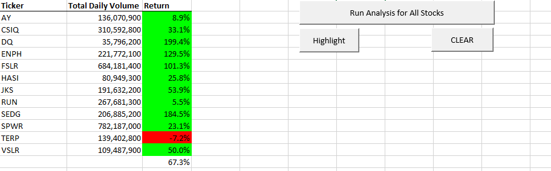
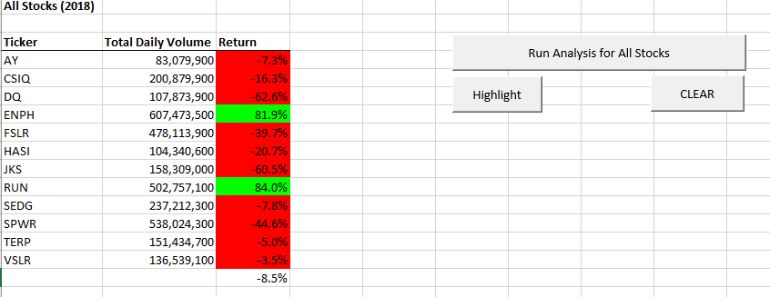

# Stocks-Analysis
VBA for analysing in Excel
## Overview

## Results
### 2017
In the year 2017 we can see that we have mainly positive returns of the stocks investments. The return value ranges from 5.5% to 199.4% which means that there is an excellent opportunity for investors. In summary for this year we have that the top 3 are:
* DQ with 199.4% which is the stock that we are interested.
* SEDG with 184.5%
* ENPH with 129.5%
There is only one stock with a negative return value (TERP with -7.2%). Altogether if you decided to invest equally in the entire portfolio you would have and average of 67.3 % ROI (Return On Investent). In the chart below we can observe the table with the results

 

### 2018
Inlike the past year, 2018 shows mainly negative returns. Only two companies had positive returns (ENPH with 81.9% and RUN with an 84%). The rest of the companies presented negative returns, ranging from -62.6% to -3.5%. The stock with the best performance is "RUN" and, contrary to the previous year DQ has the lowest performance. Which means that there are somo strange changes in between years. Altogether if you decided to invest equally in the entire portfolio you would have a negative ROI of -8.5%

 

### Comparisson and Conclusion

Stocks returns in 2017    |  Stocks returns in 2018  
:-------------------------:|:-------------------------:
    |  
