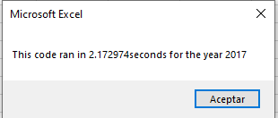
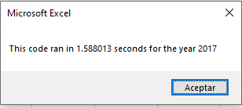
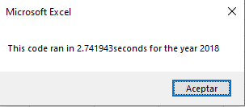
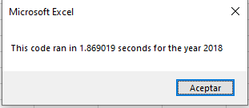

# Stocks-Analysis
## Overview
In this challenge we are using VBA for analysing a dataset of 12 different green energies stocks to determine whether or not is recomendable to invest in one of them, the clients of the user have invested in the company DQ, so a further analysis focused in this company needs to be done to determine if this was a good decision. 
## Results
### 2017
In the year 2017 we can see that we have mainly positive returns of the stocks investments. The return value ranges from 5.5% to 199.4% which means that there is an excellent opportunity for investors. In summary for this year we have that the top 3 are:
* DQ with 199.4% which is the stock that we are interested.
* SEDG with 184.5%
* ENPH with 129.5%
There is only one stock with a negative return value (TERP with -7.2%). Altogether if you decided to invest equally in the entire portfolio you would have and average of 67.3 % ROI (Return On Investent). In the chart below we can observe the table with the results

 

### 2018
Inlike the past year, 2018 shows mainly negative returns. Only two companies had positive returns (ENPH with 81.9% and RUN with an 84%). The rest of the companies presented negative returns, ranging from -62.6% to -3.5%. The stock with the best performance is "RUN" and, contrary to the previous year DQ has the lowest performance. Which means that there are somo strange changes in between years. Altogether if you decided to invest equally in the entire portfolio you would have a negative ROI of -8.5%

 

### User Interface
An user-friendly interface was developed in order to reproduce the analysis in a quick an simple way, the interface have a button to perform the analysis that displays a message box asking for the year that you want to analyse, a button to format the results to facilitate visualisation and a clear button to reset the original state of the cells. 

## Comparisson and Conclusion
As we can see in the results of the analysis there was a lot of positive return in 2017 in contrast of the amount of loss of the companies in 2018. Is shown that the "DQ" company had an outstanding performance in 2017 with almost a 200% of return, however, in 2018 its performance dropped to a -62.6%, so it is an inconsistent investment. A recommendation that I would give to potential investors is to pick companies that have a consistent grow and they don't drop as much in their anual returns, I consider that the best option to invest is "ENPH" because it had a great performance in 2017 and a grow of 81.9% in 2018, being one of the only two companies that had a positive return value. As a second choice I would recommend investing in "RUN" because it may not have had the best performnce in 2017 it had the best performance in 2018 with a 84% of return. Is not viable to invest in "TERP" since it had negative returns in both years. We can see a side by side comparisson of both years on the image below.

Stocks returns in 2017    |  Stocks returns in 2018  
:-------------------------:|:-------------------------:
    |  

As part of this challenge a refactor of the code needed to be done in order to run the script faster and make it work more efficiently with bigger datasets. The main changes performed on the code were adding arrays to hold the values of the tickers starting prices and ending prices and writing the results after all the data was analysed, avoiding to write the value each time a ticker was completely analysed and making the loop throught the dataset faster. The comparison of both code are presented in the images below.

### 2017

Original code runtime    |  Refactored code runtime  
:-------------------------:|:-------------------------:
    |  

### 2018

Original code runtime    |  Refactored code runtime  
:-------------------------:|:-------------------------:
    |  

## Summary

### What are the advantages and disadvantages of refactoring code?
#### Pros:
* Simpler and more efficient code.
* Faster runtime.
* Improving code readability.
* Easier to find bugs.
* Easier to add new capabilities to the code.
#### Cons:
* Additional effort.
* Time consuming.
* Prone to error.

### How do these pros and cons apply to refactoring the original VBA script?
The refactoring permormed on the code helped it run faster, 0.584 seconds in the year 2017 and 0.872 seconds in 2018, which may not look like a lot of improvement, but if the code was applied to a much larger dataset, those miliseconds could transform into minutes saving time for other activities. The main disadvantage is that you need to come with a solution to perform this improvements, and sometimes your idea may not be as efficient as you thought.

## Observations
I want to point out one observation of the code used for this activity, the way that it finds the starting prices and ending prices works only because the dataset is ordered, so as a recommendation I would say that you need to order the dataset before performing the analysis or develop a new way of looking for the date and the ticker index as future work.
